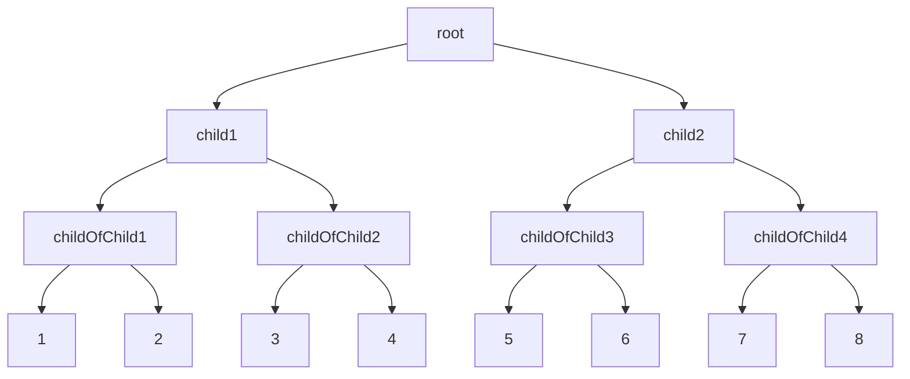
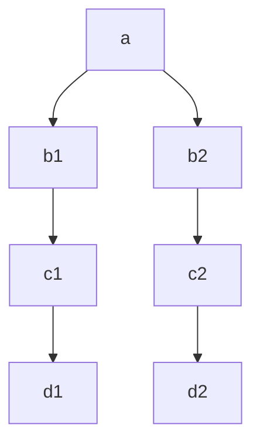

# Balanced Binary Tree

 

## ​Height-Balanced BST

`height-balanced` binary search tree  
임의의 항목 삽입과 삭제에도 자동으로 높이를 작게 유지하는 이진 검색 트리.  
N 개의 node가 있는 balanced BST 의 높이는 항상 log N 입니다.  
모든 노드의 두 하위 트리의 높이는 1보다 크지 않아야 합니다.

 

### why logN?

$2^0$ + $2^1$ + $2^2$ + $...$ + $2^h$ = $2^{h+1} - 1$

검색, 삽입, 삭제 등의 시간복잡도 : $O(log N)$

 

## 주의할 BST

위 BST는 height 균형이 잡히지 않은 Tree.  
첫번째 `b1 node` 에서 `left node`는 2차, 반면 `right node`는 0차이므로 두 노드 사이는 2차 차이가 난다.  
따라서 `non-balanced heighted Binary Search Tree` 이다.  

[BST github book](https://ondrej-kvasnovsky-2.gitbook.io/algorithms/data-structures/binary-search-tree/height-balanced-bst)

